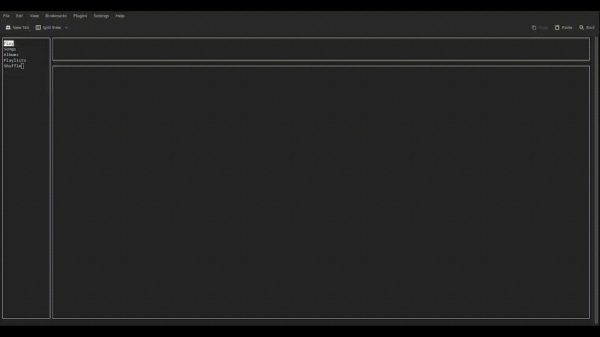

# TerminalTunes

This C++ project utilizes system audio capabilities to play various audio formats, offering a simple yet efficient way to groove to your music collection without leaving your terminal session.

# Content of Project
* [General info](#general-info)
* [Technologies](#technologies)
* [Setup](#setup)
* [Running Tests and Coverage](#running-tests-and-coverage)
* [Application view](#application-view)

## General info

Click here to see general information about <b>Project</b>!

 
This project is a comprehensive audio player application developed in C++. The application is built using CMake, a cross-platform build system, which makes it portable across different systems. The application provides a robust solution for managing and playing audio files. It allows users to create and manage playlists, add or remove songs, and play songs from a playlist. The user interface is designed to be intuitive and user-friendly, providing a seamless experience for users. The project is structured into separate directories for source files (src), header files (include), and tests (tests). This organization makes the codebase easy to navigate and maintain. The source code includes various components, each responsible for a specific part of the application's functionality. The project also emphasizes testing, as seen from the tests directory. It uses Google Test, to ensure the reliability of the code.

## Technologies

* C++17
* STL
* CMake
* GoogleTest
* Multithreading
* Templates
* Git
* SFML
* ncurses

## Setup

Install external dependencies:

<pre><code>dnf install taglib taglib-devel ncurses ncurses-devel SFML SFML-devel</code></pre>

Clone this repository to your local machine:

<pre><code>git clone https://github.com/jakubpraszkowski/TerminalTunes.git</code></pre>

Build the project using CMake.

<pre><code>cd TerminalTunes
cmake .
make</code></pre>

Run the project.

<pre><code>./MusicLibrary</code></pre>

## Running Tests and Coverage

To run tests and generate a coverage report, you need to install the following tools:

<pre><code>sudo dnf install lcov ninja-build</code></pre>

Use the provided script to run tests and generate the coverage report:

<pre><code>./run_coverage.sh</code></pre>

This script will clean the build directory, rebuild the project with coverage flags, run the tests, and generate an HTML coverage report.

## Application View
